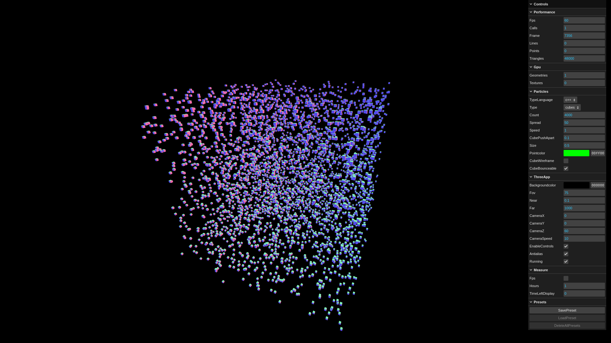

# webassembly-threejs-research

**This project is an experimental research project focused on 3D Particle System using WebAssembly and Three.js.**  


*Note: This research prototype is not production-ready.*  

## Tested with

This project was tested with the following tools and versions:
- **Emscipten** 5.0.4 (em++)
- **wasm-pack** 0.14.0
- **wasm-bindgen** 0.2.117
- **three.js** 0.182.0
- **vite** 7.3.1
- **lil-gui** 0.21.0
- **cargo** 1.89.0
- **npm** 11.6.2
- **node.js** 24.13.0
- **C++17**
- **Rust** 1.89.0 (Edition 2024)

## Cloning This Repository  

The repository can be cloned in two ways:

- **Using Git:** Run the following command in a terminal.
```sh 
git clone https://github.com/a23dilel/webassembly-threejs-research.git
```

- **Download ZIP:** On the GitHub page, click the green **Code** button and select **Download ZIP**.

## Installation and Setup

### Emscripten

1. To run and build this project using Emscripten 5.0.4, you need to install the following:  
- **Node.js** (18.3.0 or above) 
- **Python** (3.8 or above) 
- **Git** (for cloning and managing repositories)

*Note: To learn more about Emscripten requirements, you can see the official documentation:   [Emscripten Toolchain Requirements](https://emscripten.org/docs/building_from_source/toolchain_what_is_needed.html#toolchain-what-you-need) and [Test which tools are installed](https://emscripten.org/docs/building_from_source/toolchain_what_is_needed.html#toolchain-test-which-dependencies-are-installed)*

1. Navigate to the root directory of the project, which called the **webassembly-threejs-research** folder.
```sh
cd webassembly-threejs-research
```

2. Install the Emscripten SDK (emsdk) version 5.0.4 and activate it for the current user.
- **Linux/MacOS:**
```sh
./scripts/setup_emsdk.sh 
```

- **Windows:**
```sh
call scripts\setup_emsdk.bat 
```
*Note: You need to use the Command Prompt (CMD) to run the batch scripts. PowerShell is not supported.*

*Note: The shell and batch files are set to install Emscripten SDK version 5.0.4.*

3. Next is activate the Emscripten environment variables in the current terminal.
- **Linux/MacOS:**
```sh
source ./emsdk/emsdk_env.sh 
```

- **Windows:**
```sh
call emsdk\emsdk_env.bat
```
*Note: You need to activate the Emscripten environment on Linux/macOS or Windows every time you open a new terminal. Otherwise, Emscripten commands (`em++`) will not work.*

4. Now check that the Emscripten command is working.
```sh
em++ -v
```
*Note: Emscripten uses `wasm32-unknown-emscripten` target by default.*

5. Now, compile the C++ code (**lib.cpp**) to WebAssembly, which will generate **lib.js** and **lib.wasm** in the `build/c++` directory.
- **Linux/MacOS:**
```sh
./scripts/compile_cpp_to_wasm.sh 
```

- **Windows:**
```sh
call scripts\compile_cpp_to_wasm.bat 
```
*Note: The shell and batch files compile `C++17` code using `em++` with flags such as `ENVIRONMENT`, `MODULARIZE`, `EXPORT_ES6`, and exporting functions like `_malloc`,`_free` and more.*

*Note: The default WebAssembly memory is ~16 MB, which limits how many particles can be used. Each particle stores 3 values (x, y, z) using Float32Array. For example, 1000 particles -> 3000 values and 3000 × 4 bytes (float) = 12,000 bytes (~0.012 MB). This will be fit in the default memory. You can increase memory in the shell or batch scripts using: `-s INITIAL_MEMORY=32MB` or `-s INITIAL_MEMORY=64MB`. You can also enable dynamic memory with: `-s ALLOW_MEMORY_GROWTH`, which does memory to grow as needed, but it may reduce performance. It is recommended to use the default (~16 MB).*

*Note: The build uses `-Os` to reduce code size while doing optimization, and `-flto` for additional optimizations. To find more details, see: [Optimizing Code](https://emscripten.org/docs/optimizing/Optimizing-Code.html#optimizing-code).*

6. Done! JavaScript will now import the **lib.js** file from the `build/c++` directory. Next step is wasm-pack!

### Wasm-pack

1. Navigate to the root directory of the project, which called the **webassembly-threejs-research** folder.
```sh
cd webassembly-threejs-research
```

2. Install wasm-pack version 0.14.0.
```sh
cargo install wasm-pack --version 0.14.0
```
*Note: wasm-pack uses `wasm32-unknown-unknown` target by default.*


3. Now, compile the Rust code (**lib.rs**) to WebAssembly, which will generate **lib.js** and **lib_bg.wasm** in the `build/rust` directory.
- **Linux/MacOS:**
```sh
./scripts/compile_rust_to_wasm.sh 
```

- **Windows:**
```sh
call scripts\compile_rust_to_wasm.bat 
```
*Note: The shell and batch files use the `wasm-pack` command to compile Rust code to WebAssembly.*

*Note: wasm-pack/bindgen uses dynamic memory by default, which means memory can grow automatically as needed. For example, 1000 particles ->  ~1.125 MB, 10 000 particles -> ~1.375 MB, but once memory grows, it cannot shrink back, unless the program is restarted.*

*Note: The shell and batch files use the `--release` flag, which uses the `[profile.release]` settings in `Cargo.toml` file, where `opt-level = "s"` optimizes for binary size
and `lto = true` can produce better optimized code. To find more details, see: [Profiles](https://doc.rust-lang.org/cargo/reference/profiles.html).*

6. Done! JavaScript will now import the **lib.js** file from the `build/rust` directory. Now it's only left is to run three.js!

### Three.js

1. Navigate to the root directory of the project, which called the **webassembly-threejs-research** folder.
```sh
cd webassembly-threejs-research
```

2. Install the required dependencies. The project depends on Three.js, Vite and lil-gui, which are listed in `package-lock.json` after running `npm install`.
```sh
npm install
```
*Note: When you run `npm install`, it reads the `package.json` and installs all listed dependencies.*

3. After installing all dependencies, then start the project.
- **Linux/MacOS:**
```sh
npx vite ./src/
```

- **Windows:**
```sh
npx vite src\
```

4. After running the command, a local HTTP address will show in the terminal, which need to click the link or copy and paste it into your web browser's address bar, then press **Enter** to open the project. Here is an example of what a local HTTP address should look like in the terminal.
```sh
http:localhost:5173/
```

5. The setup is now complete and you can start using the project.